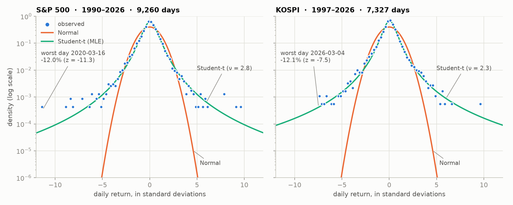
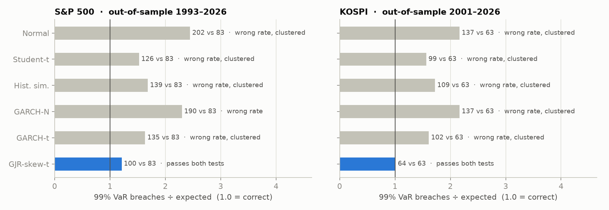
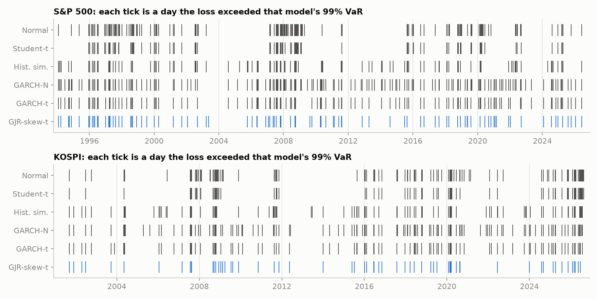
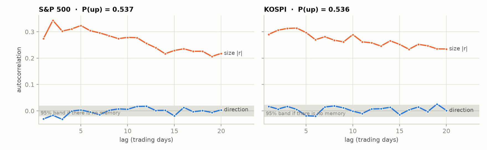
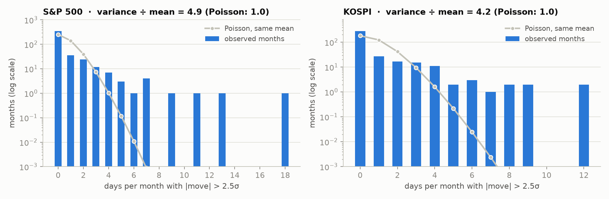
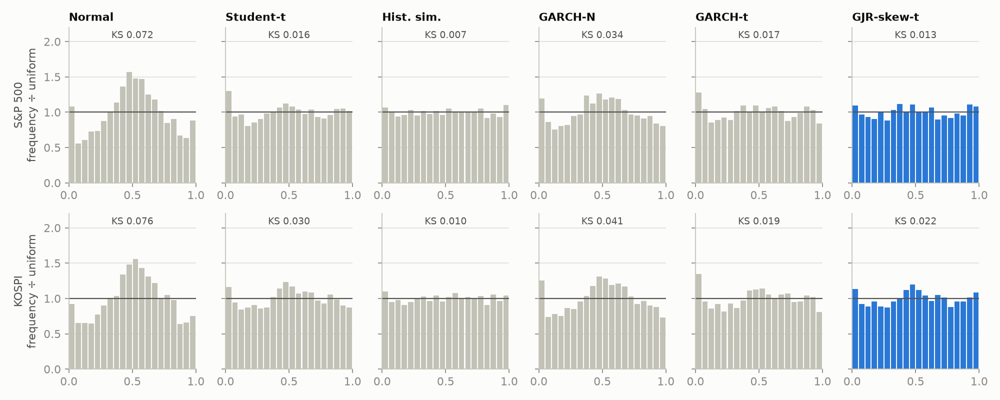

# market-distribution-tests

**Five textbook distributions, each turned into a claim about markets and tested out-of-sample on
S&P 500 and KOSPI daily returns.**

Normal, Student-t, Bernoulli, Poisson and Uniform are usually taught as shapes to draw. Here each one
becomes a falsifiable hypothesis with a proper test, and the results are tied together by one
mechanism: volatility clustering. Forecasts for day *t* use only data up to *t*−1, and a unit test
enforces it.

**Interactive version: [japark22.github.io/market-distribution-tests/](https://japark22.github.io/market-distribution-tests/)**

<picture>
  <source media="(prefers-color-scheme: dark)" srcset="figures/hero-dark.png">
  
</picture>

## Research at a glance

| Hypothesis | Test | S&P 500 (1990–2026, 9,259 days) | KOSPI (1997–2026, 7,327 days) |
|---|---|---|---|
| **H1 Normal**: daily returns are Normal | Jarque-Bera, tail counts | excess kurtosis 10.9; 62 days beyond 4σ vs 0.6 expected<br>**rejected** | excess kurtosis 7.5; 54 days beyond 4σ vs 0.5 expected<br>**rejected** |
| **H2 Student-t**: a fat-tailed t fits instead | MLE ν, AIC, VaR clustering | ν = 2.8; AIC favours t by 2,521; static-t 99% VaR breaches 1.53% of days, clustered (Christoffersen p < 0.0001)<br>**shape yes, timing no** | ν = 2.3; AIC favours t by 2,288; static-t 99% VaR breaches 1.56% of days, clustered (Christoffersen p < 0.0001)<br>**shape yes, timing no** |
| **H3 Bernoulli**: up/down is a memoryless coin | runs test, Markov χ² | P(up after up) 0.523 vs after down 0.553; Markov p = 0.0033<br>**rejected, but the memory is tiny** | P(up after up) 0.544 vs after down 0.527; Markov p = 0.1482<br>**memoryless (but biased toward up days)** |
| **H4 Poisson**: >2.5σ days arrive independently | dispersion test on monthly counts | variance ÷ mean = 4.91 (Poisson: 1); after GARCH-t filtering 1.06<br>**rejected; clustering explains it** | variance ÷ mean = 4.23 (Poisson: 1); after GARCH-t filtering 1.19<br>**rejected; clustering explains it** |
| **H5 Uniform**: forecast PITs are U(0,1) | Berkowitz + 99% VaR coverage and independence | GJR-skew-t: 100 breaches vs 83 expected, Berkowitz p = 0.0931<br>**calibrated: GJR-skew-t** | GJR-skew-t: 64 breaches vs 63 expected, Berkowitz p = 0.0675<br>**calibrated: GJR-skew-t** |

**The chain of results.** Returns are **not Normal**: S&P 500 daily excess kurtosis is 10.9, with 62 days beyond 4σ where a Normal expects 0.6. A Student-t **fixes the shape** (KS distance 0.090 → 0.015), but a static t still breaches its 99% VaR on 1.53% of days, and in bunches. The cause is **clustering**: the direction of a day is close to a coin flip (lag-1 sign autocorrelation -0.031), its size is not (+0.274). Clustering also **breaks Poisson**: monthly counts of large moves have variance 4.9× their mean, and 1.06× once a GARCH-t filter takes the clustering out. Adding volatility dynamics reduces the bunching (most breaches in any 10 days: 6 for the static t, 4 for GARCH-t) but not the bias: GARCH-t still breaches on 1.63% of days, and its misses are one-sided (PIT below 1%: 1.63%, above 99%: 0.48%). The last rung, **GJR-GARCH with skewed-t shocks**, lets bad news raise volatility more than good news and gives the left tail more weight. It is the only model whose 99% VaR passes both the Kupiec and Christoffersen tests and whose PITs pass Berkowitz in both markets: S&P 500: 100 breaches vs 83 expected; KOSPI: 64 breaches vs 63 expected.

## H1 Normal and H2 Student-t: the tails

- **S&P 500**: worst day 2020-03-16 at -12.0% (z = -11.3); best day 2008-10-13 at +11.6%. Under a Normal, a day as bad as the worst should come once every 5.9e+26 years. Excess kurtosis falls from 10.9 (daily) to 4.9 (weekly) and 2.4 (monthly).
- **KOSPI**: worst day 2026-03-04 at -12.1% (z = -7.5); best day 2026-07-31 at +17.9%. Under a Normal, a day as bad as the worst should come once every 1.0e+11 years. Excess kurtosis falls from 7.5 (daily) to 3.6 (weekly) and 2.1 (monthly).

Fat tails shrink as returns are aggregated, but a Student-t with ν around
2.8 (S&P 500), 2.3 (KOSPI) describes the daily shape far
better than the Normal. But one ν cannot fit every regime: ν = 2.8 for S&P 500, ν = 2.3 for KOSPI is below 3, where the t has no finite fourth moment, and the fitted t over-predicts the most extreme days (beyond 5σ: S&P 500 30 observed vs 42 predicted; KOSPI 19 observed vs 51 predicted). A single static t is averaging calm and stressed periods, which is a sign that volatility moves over time. The real test is a forecast. Six models, each adding one ingredient, produce a
one-day 99% VaR every day, out-of-sample. ✅ means the model passes Kupiec, Christoffersen and Berkowitz
(all p > 0.05).

| Model | What it adds | S&P 500: 99% breach rate (target 1.00%) | KOSPI: 99% breach rate (target 1.00%) |
|---|---|---:|---:|
| Normal | baseline: Normal fitted to the last 1000 days | 2.45% ❌ | 2.17% ❌ |
| Student-t | fat tails (shape) | 1.53% ❌ | 1.56% ❌ |
| Hist. sim. | no shape assumption (last 250 days) | 1.68% ❌ | 1.72% ❌ |
| GARCH-N | volatility clustering (timing) | 2.30% ❌ | 2.17% ❌ |
| GARCH-t | clustering + fat tails | 1.63% ❌ | 1.61% ❌ |
| GJR-skew-t | clustering + fat tails + asymmetry (bad news raises volatility more; heavier left tail) | 1.21% ✅ | 1.01% ✅ |

Median GJR-skew-t parameters across monthly refits (S&P 500: α = 0.000, γ = 0.172, β = 0.892, skew λ = -0.132; KOSPI: α = 0.000, γ = 0.137, β = 0.875, skew λ = -0.132). α near zero with a large γ means volatility responds mainly to *down* days, and λ < 0 is a heavier left tail: the two asymmetries the symmetric models were missing.

<picture>
  <source media="(prefers-color-scheme: dark)" srcset="figures/var_breaches-dark.png">
  
</picture>

| Market | Model | Breaches | Expected | Rate | Kupiec p (right rate) | Christoffersen p (no clustering) |
|---|---|---:|---:|---:|---:|---:|
| S&P 500 | Normal | 202 | 83 | 2.45% | <0.0001 | <0.0001 |
| S&P 500 | Student-t | 126 | 83 | 1.53% | <0.0001 | <0.0001 |
| S&P 500 | Hist. sim. | 139 | 83 | 1.68% | <0.0001 | <0.0001 |
| S&P 500 | GARCH-N | 190 | 83 | 2.30% | <0.0001 | 0.1098 |
| S&P 500 | GARCH-t | 135 | 83 | 1.63% | <0.0001 | 0.0085 |
| S&P 500 | GJR-skew-t | 100 | 83 | 1.21% | 0.0624 | 0.5064 |
| KOSPI | Normal | 137 | 63 | 2.17% | <0.0001 | <0.0001 |
| KOSPI | Student-t | 99 | 63 | 1.56% | <0.0001 | <0.0001 |
| KOSPI | Hist. sim. | 109 | 63 | 1.72% | <0.0001 | 0.0001 |
| KOSPI | GARCH-N | 137 | 63 | 2.17% | <0.0001 | 0.0404 |
| KOSPI | GARCH-t | 102 | 63 | 1.61% | <0.0001 | 0.0313 |
| KOSPI | GJR-skew-t | 64 | 63 | 1.01% | 0.9266 | 0.1721 |

At the 95% level GJR-skew-t is closer than the others but not perfect (S&P 500 453 vs 413, Kupiec p = 0.0463; KOSPI 358 vs 316, Kupiec p = 0.0185).

Where the breaches land in time shows why the unconditional models fail: they arrive in bursts
during stress periods.

<picture>
  <source media="(prefers-color-scheme: dark)" srcset="figures/breach_timeline-dark.png">
  
</picture>

## H3 Bernoulli: is each day a coin flip?

- **S&P 500**: lag-1 autocorrelation of the sign is -0.031; of the absolute return it is +0.274. Ljung-Box(10) p-value: sign 0.0081, size <0.0001.
- **KOSPI**: lag-1 autocorrelation of the sign is +0.017; of the absolute return it is +0.290. Ljung-Box(10) p-value: sign 0.1205, size <0.0001.

<picture>
  <source media="(prefers-color-scheme: dark)" srcset="figures/bernoulli-dark.png">
  
</picture>

## H4 Poisson: do big moves arrive independently?

Threshold fixed in advance at 2.5σ (full-sample σ). Counts are per calendar month.

- **S&P 500**: 248 days beyond 2.5σ across 442 months. Months with none: 79% observed vs 57% under Poisson. Busiest month: 18 days (Poisson probability of that many or more: 2.8e-21). On the out-of-sample window the dispersion is 4.95 for raw σ-events and 1.06 for GARCH-t tail events (p = 0.1831).
- **KOSPI**: 243 days beyond 2.5σ across 358 months. Months with none: 77% observed vs 51% under Poisson. Busiest month: 12 days (Poisson probability of that many or more: 1.1e-11). On the out-of-sample window the dispersion is 4.67 for raw σ-events and 1.19 for GARCH-t tail events (p = 0.0112).

Sensitivity of the dispersion ratio to the threshold: S&P 500: 2.0σ → 4.54, 2.5σ → 4.91, 3.0σ → 5.43; KOSPI: 2.0σ → 4.50, 2.5σ → 4.23, 3.0σ → 3.87.

<picture>
  <source media="(prefers-color-scheme: dark)" srcset="figures/poisson-dark.png">
  
</picture>

## H5 Uniform: are the forecasts calibrated?

The probability integral transform F<sub>t|t−1</sub>(r<sub>t</sub>) of a correct forecast is
Uniform(0,1) and independent over time (Diebold, Gunther and Tay, 1998). The Berkowitz (2001)
test checks mean, variance and autocorrelation of Φ<sup>−1</sup>(PIT) jointly.

<picture>
  <source media="(prefers-color-scheme: dark)" srcset="figures/pit-dark.png">
  
</picture>

| Market | Model | KS distance | Berkowitz p | PIT < 1% | PIT > 99% |
|---|---|---:|---:|---:|---:|
| S&P 500 | Normal | 0.0720 | <0.0001 | 2.45% | 1.76% |
| S&P 500 | Student-t | 0.0159 | <0.0001 | 1.53% | 1.02% |
| S&P 500 | Hist. sim. | 0.0068 | 0.0049 | 1.49% | 1.59% |
| S&P 500 | GARCH-N | 0.0337 | 0.0002 | 2.30% | 0.85% |
| S&P 500 | GARCH-t | 0.0173 | 0.0008 | 1.63% | 0.48% |
| S&P 500 | GJR-skew-t | 0.0129 | 0.0931 | 1.21% | 0.81% |
| KOSPI | Normal | 0.0757 | <0.0001 | 2.17% | 1.20% |
| KOSPI | Student-t | 0.0304 | 0.6782 | 1.56% | 0.85% |
| KOSPI | Hist. sim. | 0.0103 | 0.5726 | 1.44% | 1.39% |
| KOSPI | GARCH-N | 0.0410 | 0.0066 | 2.17% | 0.92% |
| KOSPI | GARCH-t | 0.0188 | 0.0068 | 1.61% | 0.49% |
| KOSPI | GJR-skew-t | 0.0222 | 0.0675 | 1.01% | 1.06% |

With several thousand out-of-sample days these tests have a lot of power, so even a good model can be
rejected for small deviations. Read the KS distance and the tail frequencies as effect sizes.
Historical simulation has the smallest KS distance but still fails in the tails, which is why the
calibration verdict also requires the 99% VaR tests. (Its PIT is a mid-rank among 250 past returns while
its VaR is an interpolated quantile, so its two 1% rates differ slightly.)

## Method

| | |
|---|---|
| Data | Yahoo Finance index closes (`^GSPC`, `^KS11`), daily log returns. Index levels, not total return. |
| Cleaning | Weekend rows and unchanged-close zero-volume rows (stale holiday prints) dropped. Moves above 10% are kept and listed in `results/data_quality.csv` for review. |
| Static models | Normal and Student-t (MLE) on the trailing 1000 days; historical simulation on the trailing 250 days. |
| GARCH | GARCH(1,1) with Normal or standardised-t shocks, and GJR-GARCH(1,1) with Hansen skewed-t shocks; constant mean (`arch`). Re-estimated every 21 days on the trailing 1000 days; variance filtered forward daily with fixed parameters. |
| Point-in-time | Every forecast for day *t* uses returns dated *t*−1 or earlier. `tests/test_forecast.py` multiplies all returns after a cut-off by 5 and checks that earlier forecasts do not move. |
| VaR tests | Kupiec (1995) unconditional coverage, Christoffersen (1998) independence. |
| Refresh | GitHub Actions re-downloads prices, reruns the tests, and regenerates this README, the figures and the site every week. |

Last run: 2026-10-09T07:56:31Z. All numbers above are read from [`results/summary.json`](results/summary.json).

## Limitations

- **Index levels without dividends.** This understates the mean by roughly the dividend yield, which
  barely matters for one-day tails but does shift the share of up days slightly.
- **Single-name price limits.** Korean stocks had a ±15% daily limit until June 2015 (±30% since),
  which can truncate KOSPI index tails in the earlier years.
- **Many tests, large samples.** Some p-values will be small by chance or for economically trivial
  deviations. The figures and effect sizes matter more than any single p-value.
- **One passing model is not a proven model.** GJR-skew-t passing at 99% is one level, two markets,
  and a handful of tests; it was added after the symmetric models failed, so treat it as the next
  hypothesis, not a final answer. No realised-volatility inputs or regime switching are tried.
- **Extreme days are kept, not trimmed.** S&P 500 worst 2020-03-16 (-12.0%), best 2008-10-13 (+11.6%); KOSPI worst 2026-03-04 (-12.1%), best 2026-07-31 (+17.9%). `results/data_quality.csv` lists all 13 moves above 10%; 0 of them reverse the next day (the signature of a bad print). Recent extremes carry a lot of weight in tail statistics, so results can move when the weekly refresh adds a crisis.

## Reproduce

```bash
pip install -r requirements.txt
python scripts/run_all.py --refresh   # download prices, run every test (about 3 minutes)
python scripts/make_figures.py
python scripts/build_readme.py
pytest -q                             # simulation-based tests, including the no-lookahead check
```

```
mdt/forecast.py      rolling out-of-sample predictive distributions (6 models)
mdt/hypotheses.py    H1 to H5 tests, Kupiec, Christoffersen, Berkowitz
mdt/data.py          download, cleaning audit, log returns
scripts/             run_all, make_figures, build_readme
docs/                GitHub Pages site (index.html + data.json)
results/             summary.json, CSV outputs, GJR-skew-t parameter paths, run_log.csv
tests/               known-distribution simulations and the lookahead test
```

## References

- Berkowitz, J. (2001). Testing density forecasts, with applications to risk management. *JBES*.
- Christoffersen, P. (1998). Evaluating interval forecasts. *International Economic Review*.
- Cont, R. (2001). Empirical properties of asset returns: stylized facts and statistical issues. *Quantitative Finance*.
- Diebold, F., Gunther, T., Tay, A. (1998). Evaluating density forecasts. *International Economic Review*.
- Kupiec, P. (1995). Techniques for verifying the accuracy of risk measurement models. *Journal of Derivatives*.
